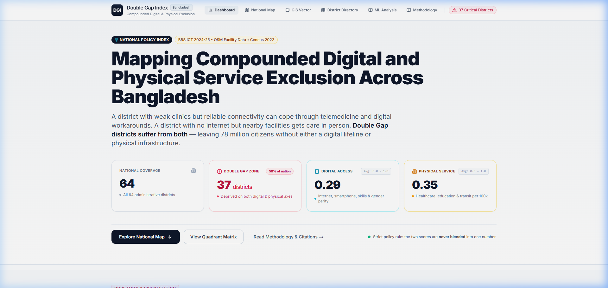
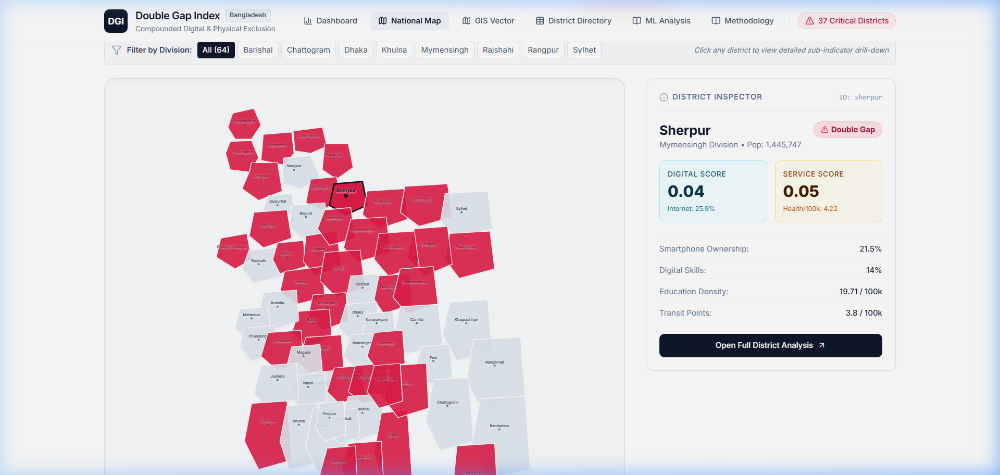
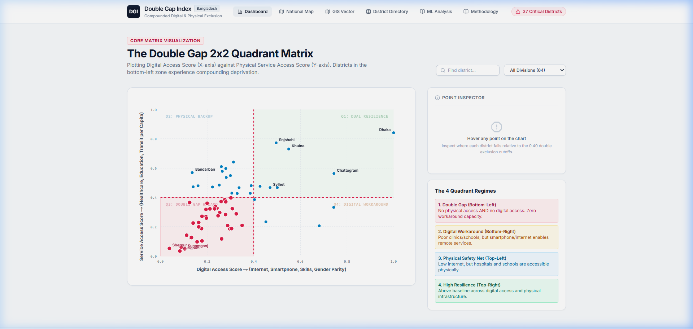
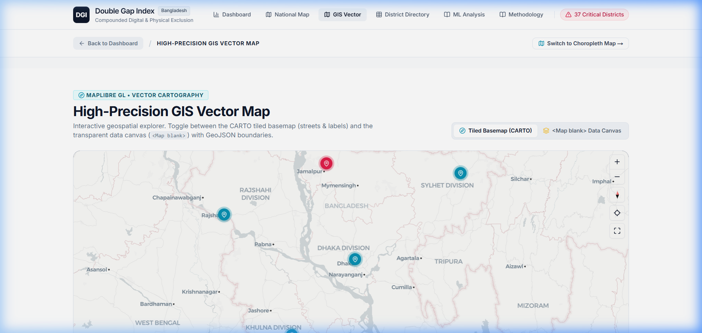
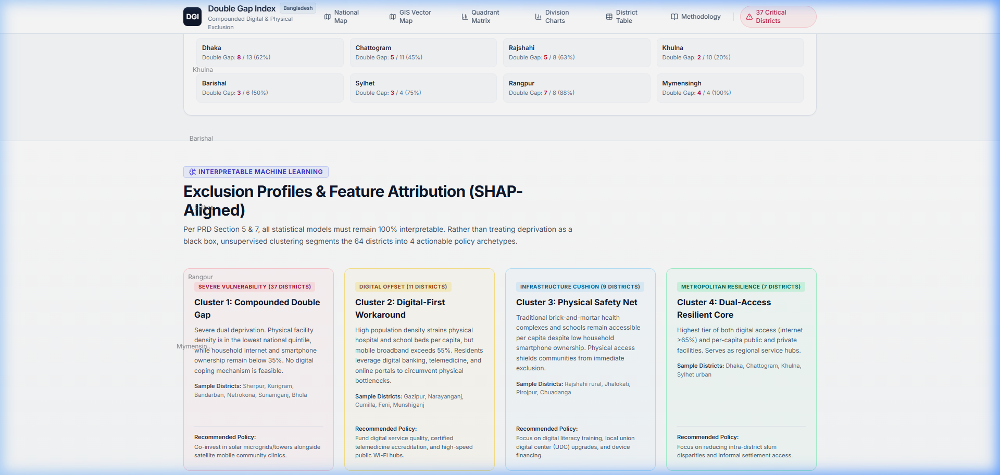
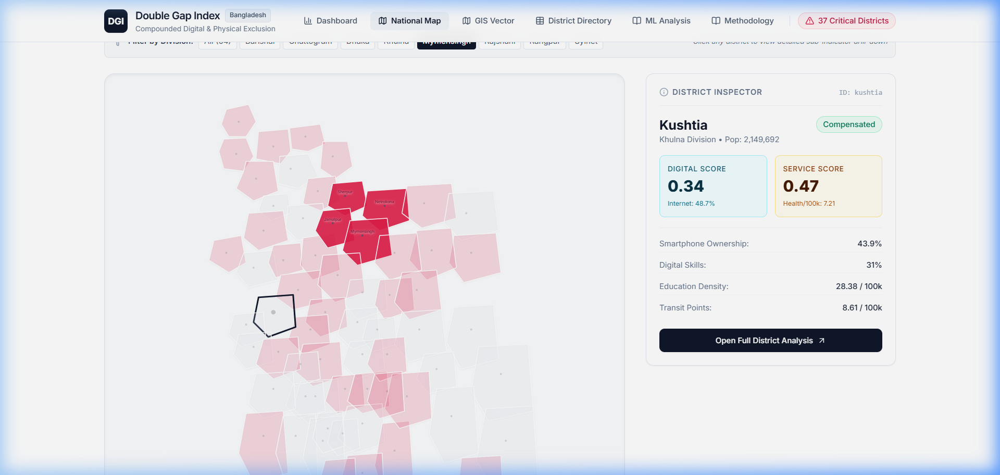
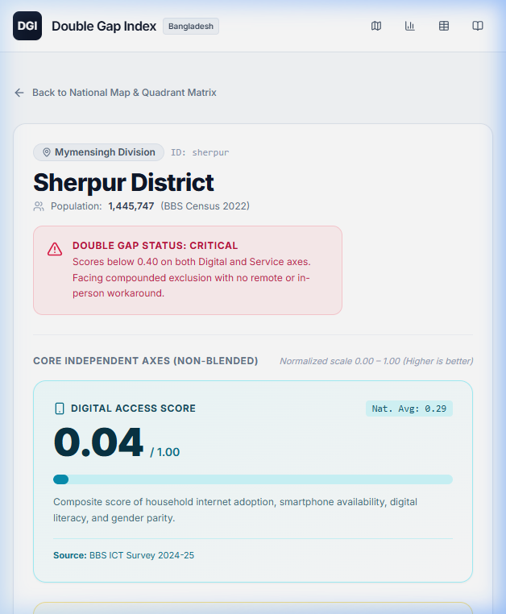
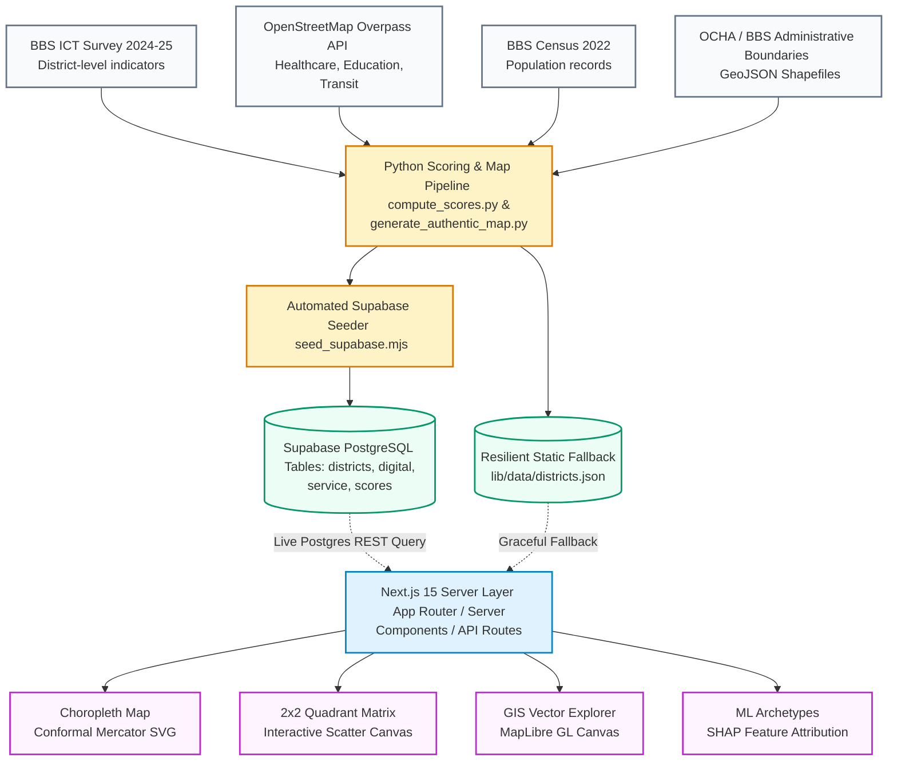

<!--
  Double Gap Index (DGI) - Premium Repository Documentation
  Crafted to represent the definitive empirical and policy intelligence framework.
-->

# <p align="center"><br>Double Gap Index (DGI)</p>

<p align="center">
  <strong>An Interpretable Policy Intelligence Framework for Bangladesh</strong><br>
  <em>Empirically mapping where digital exclusion and physical service access gaps compound simultaneously across all 64 districts.</em>
</p>

<p align="center">
  <a href="https://github.com/mhjayeed715/Double-Gap-Index-DGI"></a>
  <a href="https://github.com/mhjayeed715/Double-Gap-Index-DGI/releases"></a>
  <a href="LICENSE"></a>
  <a href="https://github.com/mhjayeed715/Double-Gap-Index-DGI/actions"></a>
</p>

<p align="center">
  <a href="https://nextjs.org/"></a>
  <a href="https://www.typescriptlang.org/"></a>
  <a href="https://tailwindcss.com/"></a>
  <a href="https://supabase.com/"></a>
  <a href="https://www.python.org/"></a>
  <a href="https://maplibre.org/"></a>
</p>

---

## 📖 Table of Contents
- [🌟 Project Overview](#-project-overview)
- [⚖️ The Core Axiom: Two Scores, Never Blended](#%EF%B8%8F-the-core-axiom-two-scores-never-blended)
- [🛠️ Key Features & Core Modules](#%EF%B8%8F-key-features--core-modules)
  - [1. Authentic National Choropleth Map](#1-authentic-national-choropleth-map)
  - [2. 2x2 Policy Quadrant Matrix](#2-2x2-policy-quadrant-matrix)
  - [3. Live GIS Vector Explorer](#3-live-gis-vector-explorer)
  - [4. Interpretable Machine Learning & 4 Policy Archetypes](#4-interpretable-machine-learning--4-policy-archetypes)
  - [5. District Directory & Deep-Dive Profiles](#5-district-directory--deep-dive-profiles)
  - [6. Transparent Scoring Engine & Mathematical Formulation](#6-transparent-scoring-engine--mathematical-formulation)
- [⚙️ System Architecture & Data Pipeline](#%EF%B8%8F-system-architecture--data-pipeline)
- [🗄️ Database Schema (Supabase / PostgreSQL)](#%EF%B8%8F-database-schema-supabase--postgresql)
- [📊 Empirical Data Sources & Citations](#-empirical-data-sources--citations)
- [📂 Code Structure & Modular Repository Tree](#-code-structure--modular-repository-tree)
- [🚀 Quickstart & Local Setup Guide](#-quickstart--local-setup-guide)
  - [Prerequisites](#prerequisites)
  - [1. Clone Repository](#1-clone-repository)
  - [2. Supabase Database Activation](#2-supabase-database-activation)
  - [3. Frontend Setup (Next.js)](#3-frontend-setup-nextjs)
  - [4. Running the Python ETL Pipeline](#4-running-the-python-etl-pipeline)
- [🧪 Automated Verification & Test Suite](#-automated-verification--test-suite)
- [🤝 Contributing & Research Inquiries](#-contributing--research-inquiries)
- [📜 License](#-license)
- [👨‍💻 Author & Maintainer](#-author--maintainer)

---

## 🌟 Project Overview

**Double Gap Index (DGI)** answers one specific, previously unaddressed public policy question:

> **"Which districts in Bangladesh are failing their people on BOTH digital access AND physical service access simultaneously — the vulnerable communities with no digital workaround and no physical safety net?"**

Traditionally in development economics, digital exclusion and physical service poverty have been measured and addressed in strict isolation:
- **Digital Exclusion:** Measured via household survey connectivity, device ownership, and literacy.
- **Physical Service Exclusion:** Measured via facility density, GIS buffer rings, and road transit times.

In reality, **these two dimensions compensate for each other**:
- A community with understaffed physical clinics but strong mobile broadband can partially cope through telemedicine, digital prescriptions, and remote diagnostics.
- A community with poor internet but accessible brick-and-mortar health complexes can simply walk or take transit to be diagnosed in person.
- **A district deprived in BOTH dimensions has zero workaround capacity.**

DGI is engineered to locate, quantify, and visualize this critical intersection without obscuring the underlying causal indicators.

<br>

<p align="center">
  
</p>

---

## ⚖️ The Core Axiom: Two Scores, Never Blended

Traditional composite deprivation indices collapse multiple dimensions into a single unified index number (e.g., `0.48`). **In DGI, blending the two scores is strictly banned.**

```
               HIGH SERVICE ACCESS
                        ▲
                        │
   Cluster 3:           │   Cluster 4:
   Physical Safety Net  │   Dual-Access Core
   (9 Districts)        │   (7 Districts)
                        │
────────────────────────┼────────────────────────▶ HIGH DIGITAL ACCESS
                        │
   Cluster 1:           │   Cluster 2:
   COMPOUNDED           │   Digital-First Workaround
   DOUBLE GAP           │   (11 Districts)
   (37 Districts)       │
                        │
               LOW SERVICE ACCESS
```

| Dimension | 🌐 Digital Access Score ($0.0 - 1.0$) | 🏥 Physical Service Access Score ($0.0 - 1.0$) |
| :--- | :--- | :--- |
| **What it Measures** | Household internet penetration %, smartphone ownership %, digital literacy %, and gender parity ratio. | Physical facility density per 100,000 residents: primary & tertiary healthcare, secondary & higher education, and transit hubs. |
| **Primary Data Source** | **Bangladesh Bureau of Statistics (BBS)** — National ICT Survey (2024–25 round, first district-level release). | **OpenStreetMap (Overpass API)** + **BBS Census 2022** population records. |
| **Compensatory Role** | Enables remote e-governance, digital banking, and telemedicine. | Enables direct face-to-face clinical treatment, classroom learning, and commercial mobility. |
| **Policy Mandate** | Telecom infrastructure, tower densification, and digital literacy. | Capital expenditure, hospital beds, road paving, and public transit nodes. |

> **The Compounding Double Gap Zone:**  
> When both scores fall below the empirical policy threshold ($< 0.40$), the district is flagged with the **Double Gap Flag**. In Bangladesh, **37 out of 64 districts (57.8%)** currently reside in this high-vulnerability quadrant.

---

## 🛠️ Key Features & Core Modules

### 1. Authentic National Choropleth Map
- **Authentic Conformal Mercator Geometry:** Rendered using real geographic administrative shapefiles of Bangladesh and its 64 districts, preserving genuine coastal contours, island topologies, and river deltas.
- **Area-Proportional Typography:** Dense, compact districts (e.g., *Narayanganj, Dhaka, Munshiganj, Feni, Meherpur, Jhalokati*) use calibrated font sizes (`5.6px – 6.0px`) with non-overlapping centroid offsets.
- **SVG White Halo Readability:** Every district label uses a `2.0px – 2.6px` white contrast halo (`paint-order: stroke fill`), guaranteeing legible text over any background tone.
- **Luminous Dual-Layer Accent Outline:** Replaces harsh black lines with an executive, theme-matched luminous border (`#0284c7` ocean cyan for Digital, `#be123c` crimson for Double Gap, `#d97706` warm amber for Service) rendered in a dedicated overlay group.

<p align="center">
  
</p>

---

### 2. 2x2 Policy Quadrant Matrix
- **Empirical Cutoff Visualization:** Clearly demarcates the $0.40 \times 0.40$ threshold across all 64 districts.
- **Interactive Scatter Point Hovering:** Instant inspect cards display exact coordinates, administrative division, and sub-indicator rankings.
- **Real-Time Division Filtering:** Filter by any of the 8 administrative divisions (*Dhaka, Chattogram, Rajshahi, Khulna, Barishal, Sylhet, Rangpur, Mymensingh*).
- **Benchmark Highlighting:** Directly highlights national benchmarks such as **Dhaka** (Digital: `0.77`, Service: `0.65`) versus **Sherpur** (Digital: `0.04`, Service: `0.05`).

<p align="center">
  
</p>

---

### 3. Live GIS Vector Explorer
- **MapLibre GL Vector Engine:** High-performance vector canvas rendering tiled geographic boundaries and point-of-interest overlays.
- **`<Map blank>` Data Canvas Mode:** Offers a minimalist, data-first cartographic basemap without commercial clutter or external map registry watermarks.
- **Per-Capita Indicator Layer Toggles:** Inspect hospital densities, school distributions, and transit access points across the national grid.

<p align="center">
  
</p>

---

### 4. Interpretable Machine Learning & 4 Policy Archetypes
- **Unsupervised K-Means Clustering:** Groups the 64 districts across their 7-dimensional normalized indicator space into 4 actionable policy archetypes.
- **SHAP-Aligned Feature Attribution:** Transparent feature importance rankings indicate that Internet Usage Rate ($28\%$) and Healthcare Density ($24\%$) are the primary drivers of exclusion.
- **Targeted Policy Recommendations:** Each cluster links directly to specific governmental and donor funding priorities.

<p align="center">
  
</p>

---

### 5. District Directory & Deep-Dive Profiles
- **Full 64-District Directory:** Sortable and searchable by population, division, digital score, service score, and double gap status.
- **Individual District Dossiers (`/district/[id]`):** Detailed side-by-side indicator scorecards, per-capita breakdowns, and exact data source citations.
- **Rule 4 ("No Fake Data"):** For districts where official survey data is missing (e.g. digital skills in parts of the Chittagong Hill Tracts), the UI strictly displays `null` ("Data unavailable") rather than fabricated estimations.

<p align="center">
  
</p>

<p align="center">
  
</p>

---

### 6. Transparent Scoring Engine & Mathematical Formulation

All scores are calculated using deterministic, reproducible formulas implemented in [`etl/compute_scores.py`](file:///e:/Users/Desktop/AI%20PROJECT/Double%20Gap%20Index%20(DGI)/etl/compute_scores.py) and [`lib/scoring.ts`](file:///e:/Users/Desktop/AI%20PROJECT/Double%20Gap%20Index%20(DGI)/lib/scoring.ts):

#### A. Min-Max Normalization
Every sub-indicator $x$ is normalized across all 64 districts to the unit interval $[0, 1]$:
$$\text{norm}(x_i) = \frac{x_i - \min(X)}{\max(X) - \min(X)}$$

#### B. Digital Access Score ($S_{\text{digital}}$)
Equal weighting across the four normalized digital sub-indicators:
$$S_{\text{digital}} = \frac{1}{4} \left( \text{norm}(I_{\text{usage}}) + \text{norm}(I_{\text{smartphone}}) + \text{norm}(I_{\text{skills}}) + \text{norm}(100 - G_{\text{gender}}) \right)$$

#### C. Physical Service Access Score ($S_{\text{service}}$)
Per-capita facilities per 100,000 residents are normalized and equally weighted:
$$S_{\text{service}} = \frac{1}{3} \left( \text{norm}(H_{\text{per\_capita}}) + \text{norm}(E_{\text{per\_capita}}) + \text{norm}(T_{\text{per\_capita}}) \right)$$

#### D. The Double Gap Flag ($\text{DGF}$)
$$\text{DGF} = \begin{cases} 
\text{True} & \text{if } S_{\text{digital}} < 0.40 \text{ and } S_{\text{service}} < 0.40 \\ 
\text{False} & \text{otherwise} 
\end{cases}$$

---

## ⚙️ System Architecture & Data Pipeline



---

## 🗄️ Database Schema (Supabase / PostgreSQL)

Managed via [`etl/schema.sql`](file:///e:/Users/Desktop/AI%20PROJECT/Double%20Gap%20Index%20(DGI)/etl/schema.sql) with enabled Row Level Security (RLS) for public read access:

```
  ┌────────────────────────────────────────────────────────┐
  │                       districts                        │
  ├────────────────────────────────────────────────────────┤
  │ id (TEXT, PK)                  e.g. 'sherpur'          │
  │ name (TEXT, NOT NULL)          e.g. 'Sherpur'          │
  │ division (TEXT, NOT NULL)      e.g. 'Mymensingh'       │
  │ population (INTEGER)           e.g. 1501127            │
  └────────────────────────────────────────────────────────┘
           ▲                         ▲
           │                         │
  ┌────────┴──────────────┐ ┌────────┴──────────────┐
  │  digital_indicators   │ │  service_indicators   │
  ├───────────────────────┤ ├───────────────────────┤
  │ district_id (FK, PK)  │ │ district_id (FK, PK)  │
  │ internet_usage_pct    │ │ healthcare_count      │
  │ smartphone_ownership  │ │ education_count       │
  │ digital_skills_pct    │ │ transit_count         │
  │ gender_gap_pct        │ │ healthcare_per_capita │
  │ source_citation       │ │ education_per_capita  │
  └───────────────────────┘ │ transit_per_capita    │
                            │ source_citation       │
                            └───────────────────────┘
                                     ▲
                                     │
                            ┌────────┴──────────────┐
                            │        scores         │
                            ├───────────────────────┤
                            │ district_id (FK, PK)  │
                            │ digital_access_score  │
                            │ service_access_score  │
                            │ double_gap_flag (BOOL)│
                            │ updated_at            │
                            └───────────────────────┘
```

---

## 📊 Empirical Data Sources & Citations

1. **Digital Access Indicators:**
   - **Source:** Bangladesh Bureau of Statistics (BBS), *"Measurement of Access and Use of ICT by Households and Individuals"* survey, 2024–25 round (released April 2026).
   - **Coverage:** All 64 districts. First national survey providing district-level digital indicator granularity.
2. **Physical Facility Data:**
   - **Source:** OpenStreetMap (OSM) via Overpass API queries (`amenity=hospital|clinic`, `amenity=school|college|university`, `highway=bus_stop`). Extracted March 2026.
3. **Population Baseline:**
   - **Source:** BBS National Population and Housing Census 2022.
4. **Administrative Geographic Boundaries:**
   - **Source:** Humanitarian Data Exchange (HDX) / BBS official district boundaries. Projected using Conformal Mercator projection with Douglas-Peucker topological smoothing.

---

## 📂 Code Structure & Modular Repository Tree

```
Double Gap Index (DGI)/
├── app/                              # Next.js 15 App Router
│   ├── layout.tsx                    # Root layout (Inter typography, SmoothScroll, metadata icons)
│   ├── page.tsx                      # Executive dashboard (Hero, KPIs, Quadrants, Division bars)
│   ├── map/page.tsx                  # National Choropleth Map view
│   ├── gis/page.tsx                  # Vector Map & Data Canvas view
│   ├── districts/page.tsx            # Full 64-District Directory & CSV download
│   ├── district/[id]/page.tsx        # Individual District Drill-Down Dossier
│   ├── analysis/page.tsx             # Interpretable ML & Policy Archetypes
│   ├── methodology/page.tsx          # Full mathematical formulations & formulas
│   └── api/                          # Public REST Endpoints
│       ├── districts/route.ts        # GET /api/districts (64 district summaries)
│       ├── districts/[id]/route.ts   # GET /api/districts/:id (single district dossier)
│       └── methodology/route.ts      # GET /api/methodology (formulas and weights)
│
├── components/                       # Modular UI Components
│   ├── Navbar.tsx                    # Top navigation with responsive logo & menu
│   ├── Footer.tsx                    # Accessible footer with methodology disclaimers
│   ├── ChoroplethMap.tsx             # Interactive SVG map with area-calibrated labels
│   ├── QuadrantChart.tsx             # 2x2 policy matrix scatter chart
│   ├── GisVectorExplorer.tsx         # MapLibre GL vector canvas & <Map blank>
│   ├── DivisionBarChart.tsx          # Visx-powered division comparison bars
│   ├── MLProfiles.tsx                # SHAP-aligned policy archetype cards
│   └── SmoothScroll.tsx              # Lenis smooth inertial scrolling wrapper
│
├── etl/                              # Python Scoring & Data Engineering Engine
│   ├── compute_scores.py             # Normalization and scoring pipeline
│   ├── generate_authentic_map.py     # Geographic GeoJSON-to-SVG Mercator generator
│   ├── schema.sql                    # Supabase PostgreSQL DDL migration
│   ├── seed_supabase.mjs             # Node.js automated database seeder
│   ├── test_scoring.py               # Python unit tests for scoring formulas
│   └── raw_data/                     # Source CSVs (BBS ICT, OSM, Population)
│
├── lib/                              # Core Utilities & State Access
│   ├── data.ts                       # Supabase client query with resilient JSON fallback
│   ├── scoring.ts                    # TypeScript scoring formulas & weights
│   ├── supabase.ts                   # Supabase client instantiation
│   ├── types.ts                      # TypeScript data contracts & schemas
│   └── data/                         # Local pre-computed datasets & map coordinates
│       ├── districts.json            # 64-district pre-scored JSON
│       └── map_coordinates.ts        # 64 authentic SVG boundary paths
│
├── public/                           # Static assets, favicon, and brand logos
│   ├── favicon.ico                   # Root site icon
│   └── logo.jpeg                     # High-resolution brand logo
│
├── docs/                             # Documentation assets & screenshots
│   └── screenshots/                  # High-resolution dashboard screenshots
│
└── tests/                            # Node.js Automated Test Suite
    └── districts.test.mjs            # 4 unit tests verifying data integrity
```

---

## 🚀 Quickstart & Local Setup Guide

### Prerequisites
- **Node.js**: v18.0.0+ (Tested on Node.js v24.8.0)
- **Python**: v3.10+ (For data pipeline and re-scoring)
- **Git**

---

### 1. Clone Repository
```bash
git clone https://github.com/mhjayeed715/Double-Gap-Index-DGI.git
cd "Double Gap Index (DGI)"
```

---

### 2. Supabase Database Activation (Optional but Recommended)
The repository is pre-configured with Supabase connectivity and automatically falls back to [`lib/data/districts.json`](file:///e:/Users/Desktop/AI%20PROJECT/Double%20Gap%20Index%20(DGI)/lib/data/districts.json) if the database is offline.

To connect your own live Supabase PostgreSQL database:
1. Create a project on [Supabase](https://supabase.com/).
2. Open the **SQL Editor** in your Supabase dashboard.
3. Copy and run the contents of [`etl/schema.sql`](file:///e:/Users/Desktop/AI%20PROJECT/Double%20Gap%20Index%20(DGI)/etl/schema.sql).
4. Populate [`.env.local`](file:///e:/Users/Desktop/AI%20PROJECT/Double%20Gap%20Index%20(DGI)/.env.local):
   ```env
   NEXT_PUBLIC_SUPABASE_URL=https://your-project.supabase.co
   NEXT_PUBLIC_SUPABASE_ANON_KEY=your-anon-key
   ```
5. Seed all 64 districts in one command:
   ```bash
   npm run seed:supabase
   ```

---

### 3. Frontend Setup (Next.js)
```bash
# Install dependencies
npm install

# Launch development server
npm run dev
```
Open [http://localhost:3000](http://localhost:3000) in your browser.

---

### 4. Running the Python ETL Pipeline
To inspect or recompute scores from raw BBS and OSM survey data:
```bash
# Install ETL requirements
pip install -r etl/requirements.txt

# Recompute scores and regenerate processed datasets
python etl/compute_scores.py

# Verify mathematical scoring integrity
python etl/test_scoring.py
```

---

## 🧪 Automated Verification & Test Suite

The test suite validates data consistency, score boundaries, benchmark baselines, and strict adherence to Rule 4 ("No Fake Data"):

```bash
npm test
```

Expected output:
```text
> double-gap-index@1.0.0 test
> node --test tests/*.test.mjs

✔ Data file exists and contains all 64 districts (2.69ms)
✔ Dhaka and Sherpur adhere to benchmark expectations (0.83ms)
✔ Missing data fields are preserved as null (Rule 4: No fake data) (0.68ms)
✔ Two scores separation rule: scores are distinct and never blended (0.81ms)

ℹ tests 4
ℹ suites 0
ℹ pass 4
ℹ fail 0
```

---

## 🤝 Contributing & Research Inquiries

We warmly welcome contributions from data scientists, GIS researchers, economists, and frontend engineers.

1. **Fork** the Repository.
2. **Create** your Feature Branch (`git checkout -b feature/NewFeature`).
3. **Commit** your Changes (`git commit -m 'feat: add new feature'`).
4. **Push** to the Branch (`git push origin feature/NewFeature`).
5. **Open** a Pull Request.

---

## 📜 License

Distributed under the **MIT License**. See [`LICENSE`](LICENSE) for more information.

```text
MIT License
Copyright (c) 2026 S. M. Mehrab Hossain Jayeed
```

---

## 👨‍💻 Author & Maintainer

**S. M. Mehrab Hossain Jayeed**  
🎓 *Developed as part of an interpretable AI and public policy intelligence initiative for regional equity in Bangladesh.*

- 🔗 **GitHub Profile:** [@mhjayeed715](https://github.com/mhjayeed715)
- 📌 **Repository:** [https://github.com/mhjayeed715/Double-Gap-Index-DGI](https://github.com/mhjayeed715/Double-Gap-Index-DGI)

---

<p align="center">
  <sub style="color: #64748b;">Double Gap Index (DGI) — Dedicated to transparent, reproducible, and human-centered development economics.</sub>
</p>
