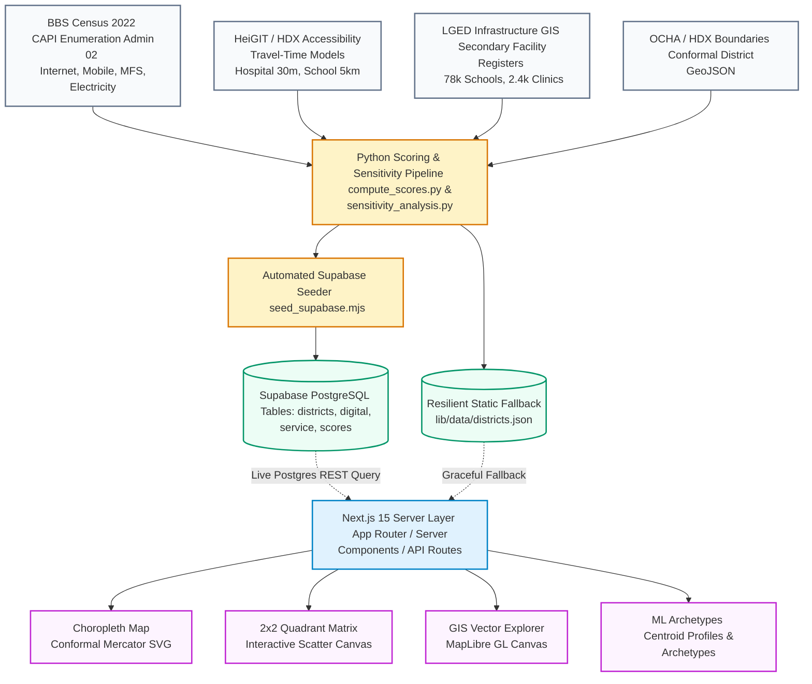

# <p align="center"><br>Double Gap Index (DGI)</p>

<p align="center">
  <strong>An Interpretable Policy Intelligence Framework for Bangladesh</strong><br>
  <em>Empirically mapping where digital exclusion and physical service access gaps compound simultaneously across all 64 districts.</em>
</p>

<p align="center">
  <a href="https://github.com/mhjayeed715/Double-Gap-Index-DGI"></a>
  <a href="https://github.com/mhjayeed715/Double-Gap-Index-DGI/actions/workflows/ci.yml"></a>
  <a href="https://github.com/mhjayeed715/Double-Gap-Index-DGI/releases"></a>
  <a href="LICENSE"></a>
  <a href="https://github.com/mhjayeed715/Double-Gap-Index-DGI/actions"></a>
</p>

<p align="center">
  <a href="https://nextjs.org/"></a>
  <a href="https://www.typescriptlang.org/"></a>
  <a href="https://tailwindcss.com/"></a>
  <a href="https://supabase.com/"></a>
  <a href="https://www.python.org/"></a>
  <a href="https://maplibre.org/"></a>
</p>

---

> ⚠️ **METHODOLOGICAL NOTICE: EMPIRICAL PILOT (BBS CENSUS 2022 & HEIGIT/HDX ACCESSIBILITY)**  
> The Double Gap Index (DGI) is an open-source policy intelligence framework and interactive GIS dashboard. This empirical pilot release evaluates all 64 districts using 100% CAPI enumeration from the **BBS Population & Housing Census 2022 (Admin 02 tables, 165.1M enumerated individuals)** for digital infrastructure, combined with **HeiGIT/HDX standardized travel-time accessibility models** and BBS Census 2022 household records for physical service infrastructure.

---

## 📖 Table of Contents
- [🌟 Project Overview](#-project-overview)
- [⚖️ The Core Axiom: Two Scores, Never Blended](#%EF%B8%8F-the-core-axiom-two-scores-never-blended)
- [🛠️ Key Features & Core Modules](#%EF%B8%8F-key-features--core-modules)
  - [1. Authentic National Choropleth Map](#1-authentic-national-choropleth-map)
  - [2. 2x2 Policy Quadrant Matrix](#2-2x2-policy-quadrant-matrix)
  - [3. Live GIS Vector Explorer](#3-live-gis-vector-explorer)
  - [4. Exploratory Machine Learning & Policy Archetypes](#4-exploratory-machine-learning--policy-archetypes)
  - [5. District Directory & Deep-Dive Profiles](#5-district-directory--deep-dive-profiles)
  - [6. Transparent Scoring Engine & Mathematical Formulation](#6-transparent-scoring-engine--mathematical-formulation)
- [📊 Dual-Anchor Sensitivity & Robustness](#-dual-anchor-sensitivity--robustness)
- [⚠️ Limitations, Proxy Biases & Ethical Disclosure](#%EF%B8%8F-limitations-proxy-biases--ethical-disclosure)
- [⚙️ System Architecture & Data Pipeline](#%EF%B8%8F-system-architecture--data-pipeline)
- [🚀 Quick Start & Local Development](#-quick-start--local-development)
- [🧪 Automated Verification & Test Suite](#-automated-verification--test-suite)
- [📄 Working Paper / Methodology Note](#-working-paper--methodology-note)
- [📜 License](#-license)
- [👨‍💻 Author & Maintainer](#-author--maintainer)

---

## 🌟 Project Overview

In development economics and spatial planning, regional vulnerability is typically measured through single composite indices (e.g. general human development or poverty index). While informative, single composite indices suffer from a fatal structural flaw: **they average away the compensatory trade-offs between digital and physical infrastructure**.

The **Double Gap Index (DGI)** addresses a critical policy question for Bangladesh:
> *Where do digital exclusion and physical service access gaps compound simultaneously, severing both digital workarounds and traditional physical safety nets?*

By synthesizing district-level data from the **Bangladesh Bureau of Statistics (BBS) Population & Housing Census 2022 (Admin 02 Dataset, 100% CAPI Enumeration across 165.1M individuals)**, travel-time accessibility models from **HeiGIT / Humanitarian Data Exchange (HDX)**, and verified administrative infrastructure registers, DGI isolates the geographic regions that require simultaneous dual-stream public capital co-investment.

<p align="center">
  
</p>

---

## ⚖️ The Core Axiom: Two Scores, Never Blended

Most spatial vulnerability dashboards blend indicators into a single scalar (e.g. $\text{Equity Score} = 0.52$). In Bangladesh's developing geography, this is counter-productive:

1. **Digital Offset:** A community with lower hospital proximity can partially compensate if mobile broadband and digital literacy are robust—residents leverage telemedicine, mobile financial services (bKash/Nagad), and remote public services.
2. **Physical Cushion:** A rural upazila with low digital adoption still maintains an essential safety net if healthcare facilities and schools are geographically accessible.
3. **The Compounded Double Gap:** When a district suffers from low digital connectivity **AND** low physical service density simultaneously, both survival avenues are severed. Blending would hide this compounded crisis.

> **Empirical Validation of Independence:** The Spearman rank correlation between the Digital Access Score and Physical Service Access Score across all 64 districts is $\mathbf{\rho = 0.1742}$ (Pearson $r = 0.3350$). Approximately **$88.8\%$ of the cross-district variance is orthogonal and unshared**, demonstrating that the two dimensions represent fundamentally distinct policy axes.

---

## 🛠️ Key Features & Core Modules

### 1. Authentic National Choropleth Map
- **Authentic Conformal Geometry:** Rendered using real geographic administrative boundaries of Bangladesh and its 64 districts, preserving genuine coastal contours, island topologies (Bhola, Sandwip, Hatiya), and river deltas.
- **Dynamic Choropleth Theming:** Real-time color classification across Digital Access, Physical Service Access, and Compounded Double Gap states.
- **Accessible Tooltips:** District name, population, digital score, service score, and exclusion tier displayed on hover.

<p align="center">
  
</p>

---

### 2. 2x2 Policy Quadrant Matrix
- **Dual-Axis Evaluation:** Maps every district on an interactive scatter canvas ($X = \text{Digital Access}$, $Y = \text{Physical Service Access}$).
- **The Four Policy Quadrants:**
  1. 🔴 **Double Gap (Compounded Exclusion):** Both digital and physical access below threshold.
  2. 🟡 **Digital Offset (Telemedicine Feasible):** High digital connectivity, strained physical infrastructure.
  3. 🔵 **Physical Cushion (Traditional Access):** Accessible physical clinics, low digital penetration.
  4. 🟢 **Dual-Access Resilient Core:** High digital connectivity and high physical facility endowment.

<p align="center">
  
</p>

---

### 3. Live GIS Vector Explorer
- **MapLibre GL Vector Engine:** High-performance vector canvas rendering tiled geographic boundaries and point-of-interest overlays.
- **`<Map blank>` Data Canvas Mode:** Minimalist, data-first cartographic basemap without commercial clutter or external map registry watermarks.
- **Per-Capita Indicator Layer Toggles:** Inspect hospital densities, school distributions, and transit access points across the national grid.

<p align="center">
  
</p>

---

### 4. Exploratory Machine Learning & Policy Archetypes
- **Unsupervised K-Means Clustering ($k=4$):** Groups the 64 districts across their 7-dimensional normalized indicator space into 4 macro policy archetypes (Silhouette Score: $0.335$, Inertia: $8.490$).
  1. 🔴 **Rural Agrarian & Coastal Belt (Low Digital, Moderate Physical) (42 districts):** High-deprivation rural and agricultural plains districts with moderate physical facility access and high grid electrification ($96.7\%$), but low digital penetration ($\overline{\text{DAS}} = 0.345, \overline{\text{SAS}} = 0.562$).
  2. 🔵 **Acute Mountain & Off-Grid Deficit (Chittagong Hill Tracts) (3 districts):** Hill Tracts districts (Bandarban, Khagrachhari, Rangamati) characterized by rugged topography, severe off-grid energy constraints ($5.4\%$ normalized electricity loading), and severe travel-time isolation ($\overline{\text{DAS}} = 0.396, \overline{\text{SAS}} = 0.093$).
  3. 🟡 **Transitional / Digital Offset (Intermediate Adoption) (12 districts):** Moderate vulnerability buffer with high physical access and emergent digital connectivity ($\overline{\text{DAS}} = 0.498, \overline{\text{SAS}} = 0.623$).
  4. 🟢 **Metropolitan Urban Belt (7 districts):** High-density metropolitan growth centers including Dhaka, Gazipur, Narayanganj, Chattogram, Khulna, Jessore, and Sylhet ($\overline{\text{DAS}} = 0.621, \overline{\text{SAS}} = 0.840$).
- **Interpretable Surrogate Tree (Depth 3):** Replicates cluster membership with **89.1% out-of-sample generalization under Leave-One-Out Cross-Validation (LOOCV: 57/64)** and **98.4% in-sample fidelity (63/64)** via 4 transparent, auditable decision rules.
- **Analytical Candor:** Unsupervised clustering serves as an exploratory diagnostic rather than an allocation oracle. All 64 districts have complete, 100% CAPI enumerated census records—zero synthetic data or imputation used.

> ⚠️ **Exploratory Scope Disclaimer:** *Clusters are exploratory; they describe multivariate structure in the data and are not causal or predictive.* Sub-clustering checks confirm that while raising $k$ splits coastal char districts from northern border districts, $k=4$ achieves the most interpretable balance of cluster cohesion and policy relevance.

<p align="center">
  
</p>

---

### 5. District Directory & Deep-Dive Profiles
- **Full 64-District Directory:** Sortable and searchable by population, division, digital score, service score, and double gap status.
- **Individual District Dossiers (`/district/[id]`):** Detailed indicator scorecards, empirical access percentages, secondary LGED administrative facility counts, and source citations.
- **Contextual Gender Equity:** Unweighted female internet usage, male internet usage, and absolute gender gaps are reported on each dossier as contextual metrics without folding collinear terms into the composite score.

<p align="center">
  
</p>

<p align="center">
  
</p>

---

### 6. Transparent Scoring Engine & Mathematical Formulation

All scores are calculated using deterministic, reproducible formulas implemented in [`etl/compute_scores.py`](etl/compute_scores.py) and [`lib/scoring.ts`](lib/scoring.ts):

#### A. Min-Max Normalization & Distributional Shift
Every sub-indicator $x$ is normalized across all 64 districts to the unit interval $[0, 1]$:
$$\text{norm}(x_i) = \frac{x_i - \min(X)}{\max(X) - \min(X)}$$

*Distributional Shift:* Evaluated across both absolute min-max thresholds and empirical distribution-relative percentiles ($P_{50}$ median and $P_{40}$ core cutoffs).

#### B. Digital Access Score ($S_{\text{digital}}$)
Equal weighting across three normalized digital sub-indicators from BBS Census 2022:
$$S_{\text{digital}} = \frac{1}{3} \left( \text{norm}(I_{\text{usage}}) + \text{norm}(M_{\text{phone}}) + \text{norm}(M_{\text{banking}}) \right)$$

- *Gender Indicator Resolution:* Total internet usage correlates $r = 0.9890$ ($\rho = 0.9896$) with female internet usage and $r = 0.9228$ with the gender parity ratio across all 64 districts. Folding female rate or parity into the composite score would simply double-count general connectivity. The gender term was dropped from the composite score and is reported as unweighted contextual metrics (`female_usage_pct`, `male_usage_pct`, `gender_gap_pct`) on district dossiers.
- *Internal Digital Collinearity:* Within the digital score, Internet Usage and Mobile Phone ownership correlate $r = +0.7212$ ($\rho = 0.6654$). This shared variance is explicitly disclosed. In contrast, Mobile Financial Services (MFS) adoption correlates $r = -0.1615$, providing an orthogonal measure of digital economic participation.

#### C. Physical Service Access Score ($S_{\text{service}}$)
Equal weighting across three normalized physical service indicators:
$$S_{\text{service}} = \frac{1}{3} \left( \text{norm}(H_{\text{access}}) + \text{norm}(E_{\text{access}}) + \text{norm}(E_{\text{electricity}}) \right)$$

- *Spatial Join Audit & Registry Skew:* A complete spatial join of 78,129 raw LGED school points against district boundaries revealed extreme surveyor sampling skew (e.g. Mymensingh: 4,581 schools vs. Panchagarh: 6 schools). Raw LGED hospital and school counts are therefore preserved as secondary administrative context rather than composite determinants.

---

## 📊 Dual-Anchor Sensitivity & Robustness

To avoid dependence on a single arbitrary cutoff, DGI employs a Dual-Anchor framework:

1. **Empirical Dual-Median Baseline (The Lead):** A zero-parameter empirical midpoint split ($\text{DAS} < 0.3987, \text{SAS} < 0.5829$) isolating **16 Double Gap districts (25.0% national share, 37.3M population)**.
2. **Dual-P40 Invariant Core:** A tighter dual 40th-percentile cutoff ($\text{DAS} < 0.3672, \text{SAS} < 0.5529$) isolating **9 Invariant Core districts (14.1% national share)** — a strict mathematical subset of the 16 dual-median districts.
   > *The 9 Invariant Core Districts:* **Bandarban, Cox's Bazar, Rajbari, Naogaon, Natore, Chapainawabganj, Lalmonirhat, Habiganj, Moulvibazar.**
3. **Buffer Transition Zone:** Exactly **7 districts** situated between the P40 core and P50 median cutoffs (**Kishoreganj, Magura, Pabna, Sirajganj, Gaibandha, Thakurgaon, Sunamganj**).

### 1. Dual-Percentile Sensitivity Matrix ($N=64$)

Because the digital and physical service dimensions follow asymmetric empirical distributions ($\text{DAS}_{\text{median}} = 0.3987$, $\text{SAS}_{\text{median}} = 0.5829$), evaluating compounded vulnerability requires quantile-anchored thresholds $(P_k \times P_k)$. The Dual-Anchor framework evaluates nested percentiles across both axes:

| Policy Specification | Quantile Level | DAS Cutoff ($X$) | SAS Cutoff ($Y$) | Flagged Districts | National Share (%) | Key Districts Flagged | Methodological Role |
| :--- | :---: | :---: | :---: | :---: | :---: | :--- | :--- |
| **Strict Lower Bound** | $P_{20}$ | $< 0.2856$ | $< 0.4972$ | **1** | **1.6%** | Lalmonirhat | Extreme Bivariate Deprivation |
| **Severe Deep Core** | $P_{25}$ | $< 0.3221$ | $< 0.5049$ | **3** | **4.7%** | Bandarban, Chapainawabganj, Lalmonirhat | Acute Outlier Perimeter |
| **High Vulnerability** | $P_{30}$ | $< 0.3365$ | $< 0.5171$ | **6** | **9.4%** | +Naogaon, Natore, Rajbari | Deep Priority Perimeter |
| **High Vulnerability** | $P_{35}$ | $< 0.3583$ | $< 0.5294$ | **8** | **12.5%** | +Habiganj, Moulvibazar | Pre-Core Perimeter |
| **Dual-P40 Invariant Core** | $\mathbf{P_{40}}$ | $\mathbf{< 0.3672}$ | $\mathbf{< 0.5529}$ | **9** | **14.1%** | +Cox's Bazar | **Specification-Invariant Core** |
| **Intermediate Transition** | $P_{45}$ | $< 0.3906$ | $< 0.5630$ | **13** | **20.3%** | +Kishoreganj, Magura, Pabna, Thakurgaon | Core Buffer Transition Band |
| **Dual-Median Baseline** | $\mathbf{P_{50}}$ | $\mathbf{< 0.3987}$ | $\mathbf{< 0.5829}$ | **16** | **25.0%** | +Gaibandha, Sirajganj, Sunamganj | **Empirical Dual-Median Lead** |
| **Broad Surveillance** | $P_{55}$ | $< 0.4096$ | $< 0.5964$ | **21** | **32.8%** | +Bhola, Patuakhali, Pirojpur, Jamalpur, Netrokona | Moderate Vulnerability Outer Band |
| **National Upper Bound** | $P_{60}$ | $< 0.4198$ | $< 0.6102$ | **24** | **37.5%** | +Barguna, Barisal, Kurigram | Extended Surveillance Perimeter |

> **Mathematical Invariant:** The 9 districts of the Dual-$P_{40}$ Invariant Core are a **strict mathematical subset** of the 13 districts at $P_{45}$, which are a **strict mathematical subset** of the 16 districts at $P_{50}$ (Dual-Median Baseline). Monotonicity holds at every step.

---

### 2. Parametric Scalar Cutoff ($\tau$) & Distributional Asymmetry Audit

> ℹ️ **Methodological Note on Dual Rulers:** The parametric $\tau$ sweep applies one shared cutoff to both axes simultaneously, which is a much stricter bar on the Service Access axis than a percentile-based cutoff (since SAS is centered near 0.58 while DAS is centered near 0.40). The Dual-Median and Dual-P40 rows instead use each axis's own distribution, which is why they are the primary reported specification.

Applying a single uncalibrated scalar cutoff $\tau$ symmetrically to both axes ($\text{DAS} < \tau \land \text{SAS} < \tau$) demonstrates why rigid scalar benchmarks distort empirical planning:

| Parametric Cutoff ($\tau$) | DAS Marginal ($\text{DAS} < \tau$) | SAS Marginal ($\text{SAS} < \tau$) | Joint Flagged ($\text{DAS} < \tau \land \text{SAS} < \tau$) | National Share (%) | Key Districts Flagged | Methodological Diagnosis |
| :---: | :---: | :---: | :---: | :---: | :--- | :--- |
| $\tau = 0.30$ | 14 districts | 3 districts | **0** | **0.0%** | None | SAS floor ($\text{SAS}_{\min} = 0.0270$) restricts joint set. |
| $\tau = 0.35$ | 22 districts | 3 districts | **1** | **1.6%** | Bandarban | Only Bandarban has $\text{DAS} < 0.35$ and $\text{SAS} < 0.35$. |
| $\tau = 0.40$ | 32 districts ($P_{50}$) | 3 districts ($P_{4.7}$) | **1** | **1.6%** | Bandarban | **Distributional Mismatch:** $\tau=0.40$ cuts at 50th percentile of DAS, but 4.7th percentile of SAS. |
| $\tau = 0.45$ | 43 districts ($P_{67}$) | 7 districts ($P_{10.9}$) | **5** | **7.8%** | Bandarban, Khagrachhari, Rangamati, Faridpur, Naogaon | SAS remains dominant bottleneck constraint. |
| $\tau = 0.50$ | 50 districts ($P_{78}$) | 13 districts ($P_{20.3}$) | **10** | **15.6%** | +Gopalganj, Rajbari, Magura, Natore, Lalmonirhat | SAS expands to 13 districts, 10 overlap with low digital. |
| $\tau = 0.55$ | 57 districts ($P_{89}$) | 25 districts ($P_{39.1}$) | **25** | **39.1%** | +Barisal, Patuakhali, Pirojpur, Cox's Bazar... | Rapid expansion as $\tau$ approaches SAS median. |
| $\tau = 0.5829$ (SAS Median) | 58 districts ($P_{90.6}$) | 32 districts ($P_{50.0}$) | **32** | **50.0%** | Full lower-half service distribution | All 32 districts below median SAS also have $\text{DAS} < 0.5829$. |

> 🔍 **Why Symmetric $\tau$ Fails on Empirical Data:**  
> In Bangladesh, **95%–99% of households in 61 plain districts have national grid electricity**, while only the 3 Chittagong Hill Tracts districts (Bandarban, Khagrachhari, Rangamati) face off-grid infrastructure. This pushes the national median of Physical Service Access to $\mathbf{0.5829}$. In contrast, internet adoption varies widely across the country, centering Digital Access around $\mathbf{0.3987}$.  
> Consequently, applying a symmetric scalar $\tau = 0.40$ creates an extreme distortion: it tests the **50th percentile** of the digital axis against the **4.7th percentile** of the service axis. This structural asymmetry proves why rigid scalar cutoffs fail and empirically justifies why the **Dual-Anchor Percentile Framework ($P_{40}$ core and $P_{50}$ median)** is the only mathematically sound specification for multidimensional infrastructure policy.

*Reproducible via `python etl/sensitivity_analysis.py`.*

---

## ⚠️ Limitations, Proxy Biases & Ethical Disclosure

Transparent public policy intelligence requires unvarnished disclosure of proxy constraints:

1. **LGED Facility Registry Sampling Bias:** Spatial intersection of 78,129 LGED points revealed that administrative facility mapping coverage varies widely across divisions. Standardized travel-time access models from HeiGIT/HDX are utilized for composite scoring to prevent surveyor omissions from artificially penalizing rural districts.
2. **Digital Indicator Internal Collinearity:** Internet penetration and mobile phone ownership correlate $r = +0.7212$ ($\rho = 0.6654$). While both reflect critical digital access dimensions, they share common device and infrastructure variance.
3. **Gender Parity Near-Collinearity:** District female internet usage correlates $r = 0.9890$ with total internet usage. Reporting gender metrics as separate unweighted indicators preserves transparency without distorting composite weights.
4. **Formal Transit vs. Rural Mobility:** Road and facility accessibility models measure travel time over motorized networks. In haor and river delta districts, seasonal monsoons and reliance on informal water transport significantly impact real travel times.
5. **Census Enumeration Horizon:** BBS Population Census data reflects 100% CAPI enumeration from June 2022. Infrastructure development post-2022 continues to advance.

---

## ⚙️ System Architecture & Data Pipeline



---

## 🚀 Quick Start & Local Development

### Prerequisites
- **Node.js**: v18.18+ or v20.x
- **Python**: v3.10+ (For data pipeline and re-scoring)
- **Git**

```bash
# 1. Clone repository
git clone https://github.com/mhjayeed715/Double-Gap-Index-DGI.git
cd "Double Gap Index (DGI)"

# 2. Install dependencies
npm install

# 3. Launch development server
npm run dev
```

Open [http://localhost:3000](http://localhost:3000) in your browser. The app runs with zero configuration using the embedded verified dataset ([`lib/data/districts.json`](lib/data/districts.json)).

### Supabase Database Activation (Optional)
To connect your own live Supabase PostgreSQL database:
1. Create a project on [Supabase](https://supabase.com/).
2. Run the SQL schema from [`etl/schema.sql`](etl/schema.sql) in your Supabase SQL Editor.
3. Add credentials to `.env.local`:
   ```env
   NEXT_PUBLIC_SUPABASE_URL=https://your-project.supabase.co
   NEXT_PUBLIC_SUPABASE_ANON_KEY=your-anon-key
   ```
4. Seed the database:
   ```bash
   npm run seed:supabase
   ```

---

## 🧪 Automated Verification & Test Suite

The automated unit tests act as **internal consistency and regression guards** (verifying score boundaries, mathematical invariants, and Rule 4 null-preservation). They validate that the system implements its defined rules correctly; they do not claim to provide empirical proof of ground truth.

```bash
npm test
```

Current test suite execution:
```text
> double-gap-index@1.0.0 test
> node --test tests/*.test.mjs

✔ Data file exists and contains all 64 districts
✔ Dhaka and Bandarban adhere to empirical census expectations
✔ 100% Census Enumeration: Zero synthetic data or missing fields in published records
✔ Two scores separation rule: scores are distinct and never blended
✔ Min-max normalization bounds: all 64 districts have scores strictly between 0 and 1
✔ Dual-Anchor Framework: Dual-median split isolates exactly 16 districts (25.0%)
✔ Dual-P40 Core Cutoff isolates exactly 9 districts and is a strict subset of Dual-Median
✔ Buffer Transition Zone contains exactly 7 districts
✔ Gender contextual metrics: unweighted rates and gaps are populated across all 64 districts
✔ Internal collinearity disclosure: Internet and mobile phone ownership are correlated
✔ Dimensional separation: Digital Access and Service Access scores exhibit moderate correlation
✔ Unsupervised clustering & decision tree: achieves valid silhouette score and >= 85% LOOCV fidelity

ℹ tests 12
ℹ suites 0
ℹ pass 12
ℹ fail 0
```

---

## 📄 Working Paper / Methodology Note

For an in-depth academic treatment of the index mathematics, statistical sensitivity sweeps, and data provenance, see the standalone technical brief:
👉 **[DGI Working Paper / Methodology Note](docs/METHODOLOGY_NOTE.md)**

```bibtex
@techreport{jayeed2026doublegap,
  author    = {Jayeed, S. M. Mehrab Hossain},
  title     = {Double Gap Index (DGI): Mapping Compounded Digital and Physical Service Exclusion in Bangladesh},
  institution = {Open Development Policy Initiative},
  year      = {2026},
  url       = {https://github.com/mhjayeed715/Double-Gap-Index-DGI}
}
```

---

## 📜 License

Distributed under the **MIT License**. See [`LICENSE`](LICENSE) for more information.

```text
MIT License
Copyright (c) 2026 S. M. Mehrab Hossain Jayeed
```

---

## 👨‍💻 Author & Maintainer

**S. M. Mehrab Hossain Jayeed**  
🎓 *Developed as an open-source development economics and interpretable AI initiative for regional equity in Bangladesh.*

- 🌐 **Portfolio Website:** [https://www.jayeed.pro.bd/](https://www.jayeed.pro.bd/)
- 🔗 **GitHub Profile:** [@mhjayeed715](https://github.com/mhjayeed715)
- 📌 **Repository:** [https://github.com/mhjayeed715/Double-Gap-Index-DGI](https://github.com/mhjayeed715/Double-Gap-Index-DGI)
